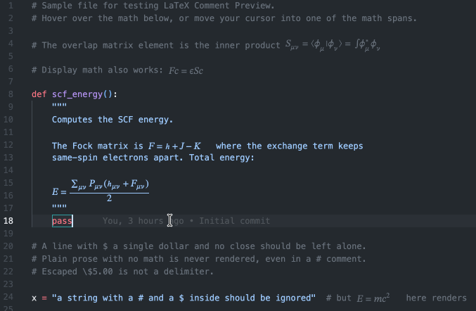

# LaTeX Comment Preview

Preview LaTeX math written inside **Python comments** — `#` line comments and
`'''` / `"""` docstrings — without leaving the editor. Inspired by inline-math
preview extensions, scoped to comments so your math notation in code reads as math.



## What it does

- **Hover preview** — hover the mouse over a `$...$` or `$$...$$` span inside a
  comment and a popup shows the rendered math.
- **Cursor preview** — move the caret (or make a selection) into a math span and
  a rendered image appears inline, just after the span. Updates live as you move.
- Only text between `$...$` (inline) and `$$...$$` (display) is rendered, so
  ordinary prose in a comment is never treated as math.
- Rendering is done by **KaTeX, bundled offline** — no network access required.

### Scope

| Detected | Example |
|---|---|
| `#` line comments | `# energy $E = mc^2$` |
| `"""` / `'''` docstrings (incl. multi-line) | `"""Fock matrix $F = h + J - K$."""` |

Math inside ordinary string literals is **not** rendered (only comments), and a
`#` or `$` inside a normal string is correctly ignored.

## Install

**From the VS Code Marketplace (recommended):** open the **Extensions** panel
in VS Code (`Cmd/Ctrl+Shift+X`), search for **"LaTeX Comment Preview"**, and
click **Install**.

**From a `.vsix` file:**

```bash
code --install-extension latex-comment-preview-1.0.3.vsix
```

Or in VS Code: **Extensions panel → ⋯ menu → Install from VSIX…**

## Develop / run from source

```bash
npm install
npm run build          # bundle to dist/extension.js
# then press F5 in VS Code to launch an Extension Development Host
```

Open `sample.py` in the dev host to try it.

## Example

The repo's [`sample.py`](sample.py) demonstrates what does and doesn't render —
hover the math, or move the caret onto a math line to reveal the source:

```python
# The overlap matrix element is the inner product $S_{\mu\nu} = \langle \phi_\mu | \phi_\nu \rangle$.

# Display math also works: $$F\mathbf{c} = \epsilon S \mathbf{c}$$

def scf_energy():
    """
    Computes the SCF energy.

    The Fock matrix is $F = h + J - K$ where the exchange term keeps
    same-spin electrons apart. Total energy:

    $$E = \sum_{\mu\nu} P_{\mu\nu} (h_{\mu\nu} + F_{\mu\nu}) / 2$$
    """
    pass

# Plain prose with no math is never rendered, even in a # comment.
# Escaped \$5.00 is not a delimiter.

x = "a string with a # and a $ inside should be ignored"  # but $E=mc^2$ here renders
```

Note the last line: `#`/`$` inside a normal string literal are ignored — only the
`$E=mc^2$` in the trailing comment renders.

## Settings

| Setting | Default | Description |
|---|---|---|
| `latexCommentPreview.enable` | `true` | Master on/off. |
| `latexCommentPreview.hover` | `true` | Show the hover popup. |
| `latexCommentPreview.inlineOnCursor` | `true` | Show the inline render when the cursor is in a span. |
| `latexCommentPreview.maxRenderLength` | `2000` | Skip spans longer than this (safety guard). |
| `latexCommentPreview.renderColor` | `""` | Override the inline math color (CSS color). Empty = auto-match the theme's comment/docstring color. Does not affect the hover. |
| `latexCommentPreview.useWebviewMeasure` | `false` | Use a background webview to measure exact rendered width (removes the trailing gap). Adds a "LaTeX Measurer" view to the Explorer sidebar. |

Command: **LaTeX Comment Preview: Toggle** (`latexCommentPreview.toggle`).

## How it works

1. A lightweight line scanner tracks comment / docstring / string state and
   extracts `$...$` and `$$...$$` spans with exact document ranges, tagging each
   span as `comment` or `docstring` (`src/parser.ts`).
2. Each span is rendered by KaTeX to MathML, wrapped in an SVG `foreignObject`,
   and embedded as a `data:` URI so it can appear in both a Markdown hover and an
   inline decoration (`src/render.ts`). Results are cached.
3. Inline rendering hides the raw `$...$` source and draws the math in its place;
   the raw source reappears when the caret is on that line so you can edit it.
4. Span color is resolved from the active theme's own `comment` / `string`
   token colors (read from the theme JSON), so the math matches the surrounding
   code (`src/theme.ts`).
5. Inline width is measured exactly by a background webview that lays the math
   out with real KaTeX fonts and reports `getBoundingClientRect()`, eliminating
   the trailing gap (`src/measurer.ts`), gated by `useWebviewMeasure`. When that
   setting is off, a font-metric estimate is used instead.

## Known limitations

- Inline width is an estimate that may leave a small trailing gap (it never
  clips). For exact widths, enable `useWebviewMeasure` — which adds a small
  "LaTeX Measurer" view to the Explorer sidebar (safe to leave collapsed; it only
  measures).

## License

MIT

---

**Author:** Evan S. Robles
**Contact:** [GitHub @evan-robles](https://github.com/evan-robles)
